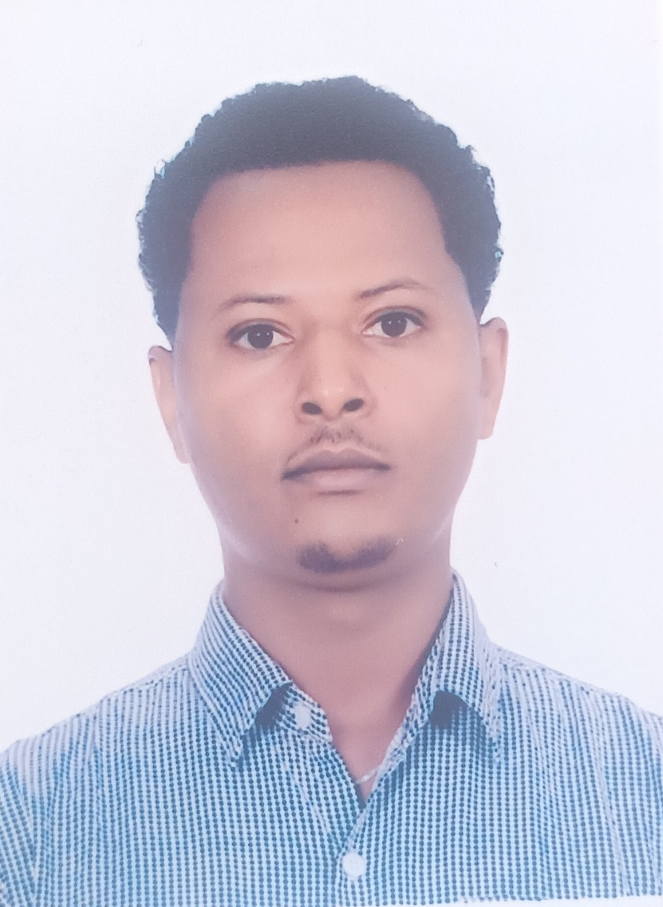

<!--  -->
 
[My Curriculum Vitae](CV_FUFA_BEYENE.pdf)

### Personal Information

<table>
<tr>
<td>

</td>
<td>
Given Name: Fufa Beyene  
Family Name: Nigussie  
Country: Ethiopia  
Phone: +251913472431
  </td>
<td>
 Email: fufa.beyene@aau.edu.et or fbbeyenefufa1@gmail.com  
Website: https://fufabeyene.github.io  
Sex: Male | Date of birth: 21/05/1986  
Religion: Christian
   </td>
</tr>
</table>
  
### Position

- March 2023-Now: Head of the Department of Mathematics
[Kotebe University of Education (KUE), Addis Ababa, Ethiopia,](www.kue.edu.et)

### Work Experience

- Jan. 2023- Now: Assistant Professor in the Department of Mathematics, [KUE, Addis Ababa, Ethiopia,](www.kue.edu.et)  
- Oct. 2017- Dec. 2022: Lecturer in the Department of Mathematics, [KUE, Addis Ababa, Ethiopia,](www.kue.edu.et)  
- Feb 2019- June 2022: Part-time Lecturer at Rift Valley University, [Rift Valley University, Addis Ababa, Ethiopia,](www.rvu.edu.et)  
- Oct. 2014- Sep.2017: Lecturer in the Department of Mathematics, [Welkite University, SNNPR, Ethiopia,](www.wku.edu.et)  
- Nov. 2012- June 2014: Program development and quality enhancement coordinator, [Wolaita Sodo University, SNNPR, Ethiopia,](www.wsu.edu.et)  
                      (Coaching, Auditing quality, Identifying and Reporting gaps)  
- Jan. 2011- Sep. 2014: Lecturer in the Department of Mathematics, [Wolaita Sodo University, SNNPR, Ethiopia,](www.wsu.edu.et)  
- Sep. 2007- Aug. 2009: Graduate assistant in the Department of Mathematics, [Wolaita Sodo University, SNNPR, Ethiopia,](www.wsu.edu.et)  
                      (Assisting, Teaching, and Mentoring)  

### Education and Training

- Sep. 2017- Jan. 2023: Ph.D. in Mathematics Combinatorics Specialty. Grade: 3.91/4.00. [Addis Ababa University, Addis Ababa, Ethiopia,](www.aau.edu.et)  
- Sep. 2012- June 2013: Higher Diploma Program (HDP) Certificate, [Wolaita Sodo University, SNNPR, Ethiopia,](www.wsu.edu.et)   
- Sep. 2009- Jan. 2011: M.SC. Degree in Mathematics. Grade: 3.83/4.00 [Addis Ababa University, Addis Ababa, Ethiopia,](www.aau.edu.et)  
- Sep. 2004- July. 2007: B.Ed Degree in Mathematics. Grade: 3.61/4.00 [Mekelle University, Tigri, Ethiopia,](www.mu.edu.et)   

### Ph.D. Thesis title

- Some Combinatorial Results on Set Partitions and Permutations by Means of Subexcedant
Functions, January 2023, Addis Ababa University, Ethiopia.

### Personal Skills

- Mother tongue; Afaan Oromoo  
- Other languages  
  - English-Proficient user  
  - Amharic-Proficient user  
- Communication skills: I have good communication skills. (Gained through my experience in teaching, leading, and coordinating)  

### Managerial skills

- Head of Department: responsible for more than 30 staff members of the Dep’t of Mathematics.  
- Departmental curriculum committee leader: (developing, validating, and implementation of curriculum)  
- Faculty Quality Enhancement and Curriculum Development Coordinator: leadership (previously responsible for a Faculty of 8 departments)  
- Ethiopian Evangelical Church Mekane Yesus Leader: (Lege Tafo Congregation deputy chair of leaders, 2023-Now, 
Welkite Congregation Leaders committee member, 2015-2016)  
- Fellowship of Oromo Christian University Students Leader: Fellowship leader at Wolaita Sodo, Ethiopia, 2007-09 and 2012-2014, Fellowship leader at Mekelle, Ethiopia, 2005-2007.
  
### Teaching Materials

- A textbook on ‘Discrete Mathematics for Beginners’ with other colleagues, Welkite University, 2016  
- A textbook on ‘Transformation Geometry’, Welkite University, 2015
  
### Job-related skills

- Community service: tutoring high school students and providing them manual with mathematics problems  
- Good command of educational quality audit  
- A graduate project work on ’A survey of the Fine Numbers’  
- An undergraduate case study on ’A comparison of students performance between urban and rural students at Alamata Senior Secondary School, Southern Tigri, Ethiopia.
  
### Computer skills

- Good command of LaTEx, MS Word, Excel, Publisher, and PowerPoint.  
- Mathematical Software: Good command of Mathematica, SPSS, Python, SageMath.
