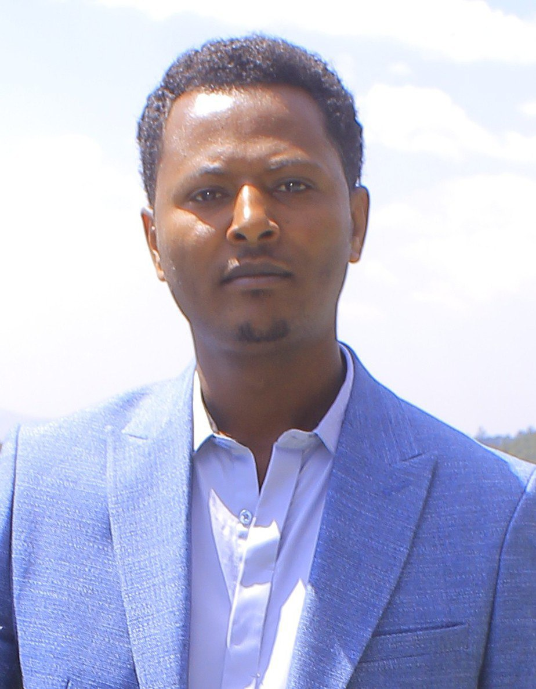

<!--  -->

 

I am a Ph.D. holder in Mathematics in Combinatorics and an assitant professor at [**Kotebe University of Education**](https://www.kue.edu.et). I earned my **Ph.D. in Mathematics with Combinatorics Specialization** from Addis Ababa University under the supervision of [Roberto Mantaci](http://www.informatique.univ-paris-diderot.fr/), and the co-supervisions of [Samuel A. Fufa](https://www.aau.edu.et) and [Jörgen Backelin](https://www.su.se/joeb). As part of my Ph.D. research work, I have also been collaborating with [Per Alexandersson] (https://www.alexandersson.symmetricfunctions.com).

To learn more about my work experiences, click on the [cv tab](cv), to learn more about my  **Ph.D. thesis** and my research, click on the [research tab](research). To read more about my **teaching activities**, click on the [teaching tab](teaching).

## Contact:

fufa.beyene@aau.edu.et

Kotebe University of Education  
Department of Mathematics   
Room: Department head office

